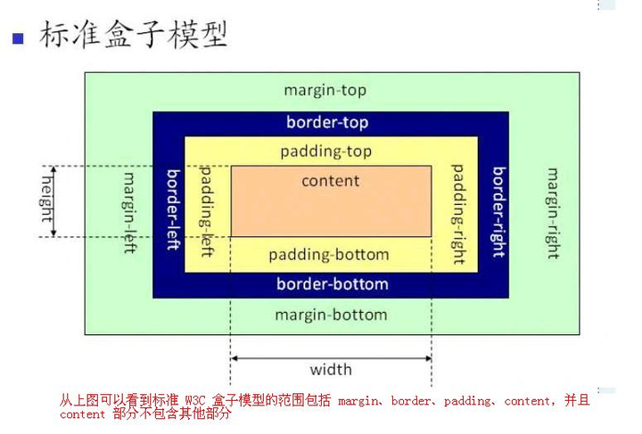
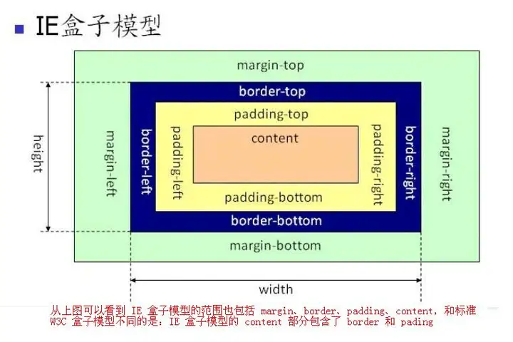
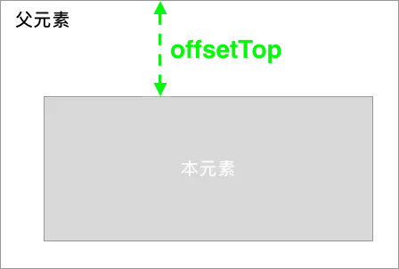
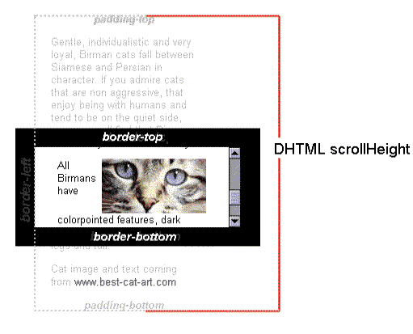
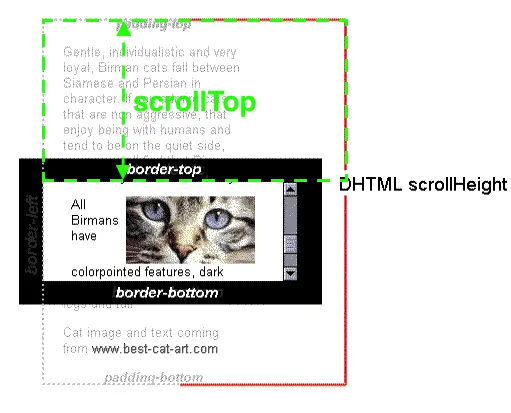

# 盒子模型

# 元素的offsetHeight、scrollHeight、clientHeight属性

offsetHeight: 包含元素的边框、内边距、内容和元素的水平滚动条（如果存在且渲染的话）

offsetTop: 仅仅是元素边框之间的距离，当前元素相对于最近的定位父元素或者最近的 `table`, `td`, `th`, `body` 元素

scrollHeight: 只读属性 包括由于溢出导致的视图中不可见内容 即包括元素的内边距、内容高度

scrollTop: 可以获取或设置元素内容从其顶部边缘滚动的像素数

clientHeight: 通过 CSS `height` + CSS `padding` - 水平滚动条高度（如果存在）来计算

clientTop: 获取元素顶部边框的宽度（以像素表示）